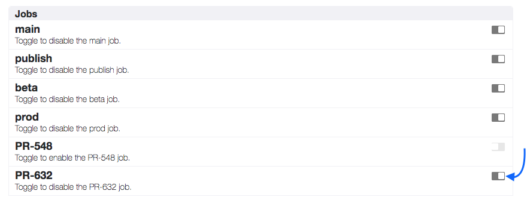

# Frequently Asked Questions

## How do I skip a build?

You might want to skip a build if you're only changing documentation.

 If you don't want Screwdriver to trigger a build when you're pushing to master, add `[ci skip]` or `[skip ci]` somewhere in the commit message. If you don't want Screwdriver to trigger a build when you merge a pull request, add `[ci skip]` or `[skip ci]` to the pull request title.

_Note: Doesn't apply to pull request builds: a commit message containing `[skip ci]` or `[ci skip]` will still trigger a pre-commit job (a PR job will always run)._

## How do I create a pipeline?

To create a pipeline, click the Create icon and paste a Git URL into the form. Followed by `#` and the branch name, if the branch is not `master`.

## How do I start a pipeline manually?

To start a build manually, click the Start button on your pipeline page.

## How do I update a pipeline repo and branch?

If you want to update your pipeline repo and branch, modify the checkout URL in the Options tab on your pipeline page and click Update.

## How do I disable/enable a job temporarily?

To temporarily disable/enable a job to quickly stop the line, toggle the switch to disable/enable for a particular job under the Options tab on your pipeline page.

## How do I make sure my code is in sync with my pipeline?

If your pipeline looks out of sync after changes were made to it, to make sure it's in sync with your source code. On the Options tab in your pipeline page, click the Sync icon to update the out of sync elements. There are separate Sync icons for SCM webhooks, pull request builds, and pipeline jobs.

## How do I delete a pipeline permanently?

Individual pipelines may be removed by clicking the Delete icon on the Options tab in your pipeline page. This action is not undoable.

## How do I fix "Build failed to start" error message?

This is caused by a variety of reasons including cluster setup issue like hyperd down (if using executor vm) or a problem with your build image etc. Fixing this issue
requires different approaches based on what layer it's failing.

1.`/opt/sd/launch: not found` This issue affects Alpine based images because it uses musl instead of glibc. Workaround is to create the following symlink `mkdir /lib64 && ln -s /lib/libc.musl-x86_64.so.1 /lib64/ld-linux-x86-64.so.2` when creating your Docker image.
